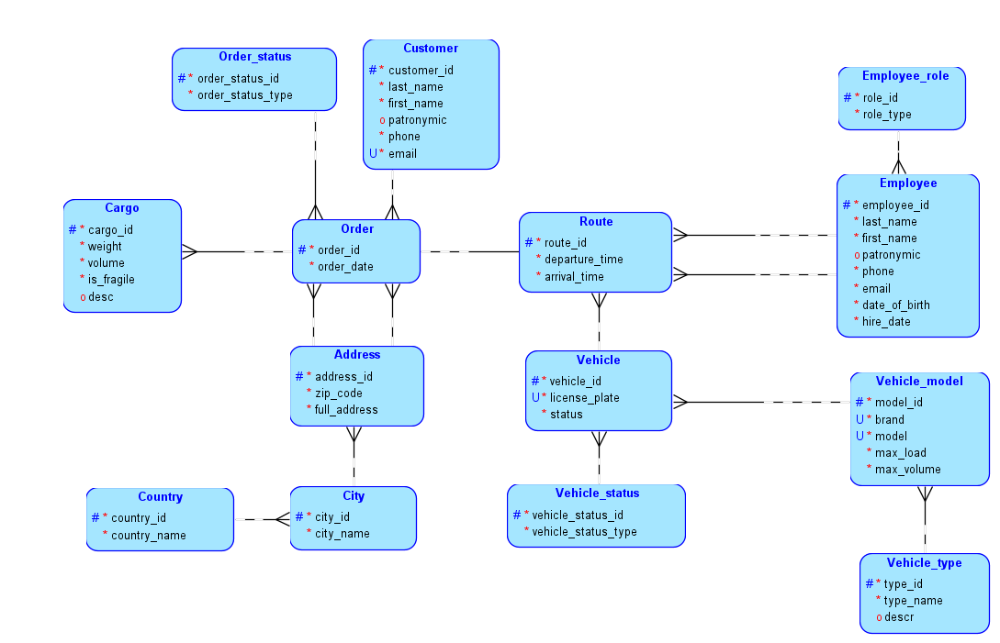
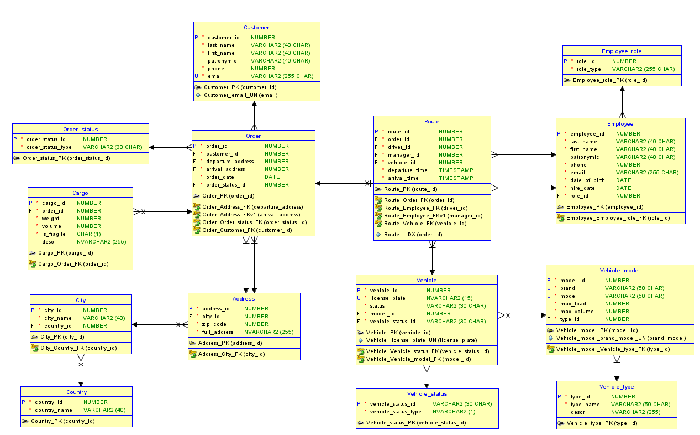

# postgresql-labs

## Домашнее задание 2

Необходимо спроектировать базу данных для предметной области "Грузоперевозки", соблюдая 3 н.ф. и НФБК. Предоставить запрос на создание таблиц.

### Проектирование БД

Для проектирования использовалось ПО Oracle SQL Developer Data Modeler, так как ~~оно уже было установлено на ПК~~ это значительно упрощало процесс.

#### Сущности

В рамках предметной области были выбраны следующие сущности:

| №    | Наименование   | Определение                                                     |
|:----:|----------------|-----------------------------------------------------------------|
| 1    | Employee_role  | Список должностей сотрудников                                   |
| 2    | Employee       | Сотрудники фирмы грузоперевозок                                 |
| 3    | Customer       | Клиенты фирмы грузоперевозок                                    |
| 4    | Vehicle_status | Статусы транспортных средств                                    |
| 5    | Vehicle_type   | Типы транспортных средств                                       |
| 6    | Vehicle_model  | Марки и модели транспортных средств                             |
| 7    | Vehicle        | Транспортные средства, на которых осуществляются грузоперевозки |
| 8    | Country        | Список стран, в которых действует фирма грузоперевозок          |
| 9    | City           | Список городов с привязкой к странам                            |
| 10   | Address        | Адреса с привязкой к городам                                    |
| 11   | Order_status   | Статусы заказов                                                 |
| 12   | Orders         | Данные о заказах в фирме грузоперевозок                         |
| 13   | Cargo          | Данные о грузах, которые содержатся в заказе                    |
| 14   | Route          | Маршруты перевозки заказов                                      |

#### Описание связей

| №    | Родительская сущность | Дочерняя сущность | Мощность   | Описание |
|:----:|-----------------------|-------------------|:----------:|----------|
| 1    | Employee_role         | Employee          | 1:N        | За каждым сотрудником закрепляется должность. Должность может принадлежать разным сотрудникам |
| 2    | Country               | City              | 1:N        | Каждый город принадлежит определенной стране. Одна страна может назначаться нескольким городам |
| 3    | City                  | Address           | 1:N        | Каждый адрес принадлежит определенному городу. В городе существует множество адресов |
| 4    | Vehicle_type          | Vehicle_model     | 1:N        | За каждой маркой и моделью транспортного средства (ТС) закреплен тип. Тип может принадлежать разным моделям ТС|
| 5    | Vehicle_model         | Vehicle           | 1:N        | За каждым ТС закреплена марка и модель. Марка и модель могут принадлежать к разным ТС |
| 6    | Vehicle_status        | Vehicle           | 1:N        | Каждое ТС имеет один статус. Один статус может применяться к множеству ТС |
| 7    | Order_status          | Orders            | 1:N        | Каждый заказ имеет один статус. Один статус может применяться к множеству заказов |
| 8    | Address               | Orders            | 1:N        | Каждый заказ связан с двумя адресами (адрес отправки и адрес доставки). Один адрес может быть у разных заказов |
| 9    | Customer              | Orders            | 1:N        | За каждым заказом закреплен один клиент. Клиент может делать множество заказов |
| 10   | Orders                | Cargo             | 1:N        | Каждый груз относится к определенному заказу. Каждый заказ может иметь несколько грузов |
| 11   | Orders                | Route             | 1:1        | Каждый маршрут относится к определенному заказу. Каждый заказ имеет один маршрут |
| 12   | Vehicle               | Route             | 1:N        | За каждым маршрутом закреплено определенное ТС. ТС может относиться к разным маршрутам |
| 13   | Employee              | Route             | 1:N        | Каждый маршрут связан с двумя сотрудниками (водитель и менеджер). Один водитель, как и менеджер, может быть у разных маршрутов |

#### Диаграмма логической модели

Логическая модель отображает сущности, начальный набор атрибутов и связи. 

#### Диаграмма физической модели

Диаграмма физической модели включает в себя сущности, их первичные и внешние ключи, все атрибуты сущностей с указанием их типов данных и связи между ними.

Так как моделирование производилось в сервисе от Oracle, то некоторые типы данных на диаграмме не соответствуют тем, которые используются в PostgreSQL (это исправлено в скрипте). Еще есть ошибка в таблице Vehicle: сначала предполагалось сделать атрибут `status` и ограничить его значения с помощью `IN`, но в итоге приняла решение делать отдельный справочник, забыв удалить атрибут.

### Запрос на создание таблиц

Запрос на создание таблиц: [create-запрос](lab2/create-script.sql)
